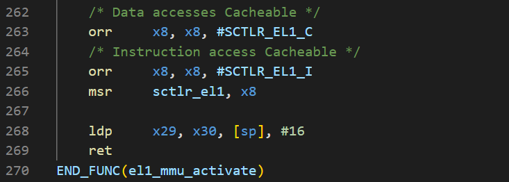
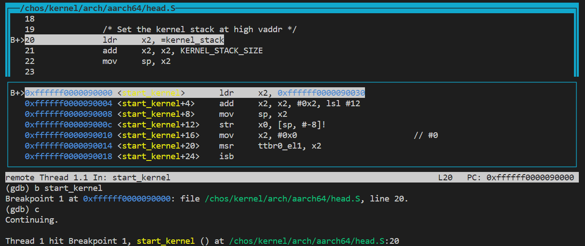
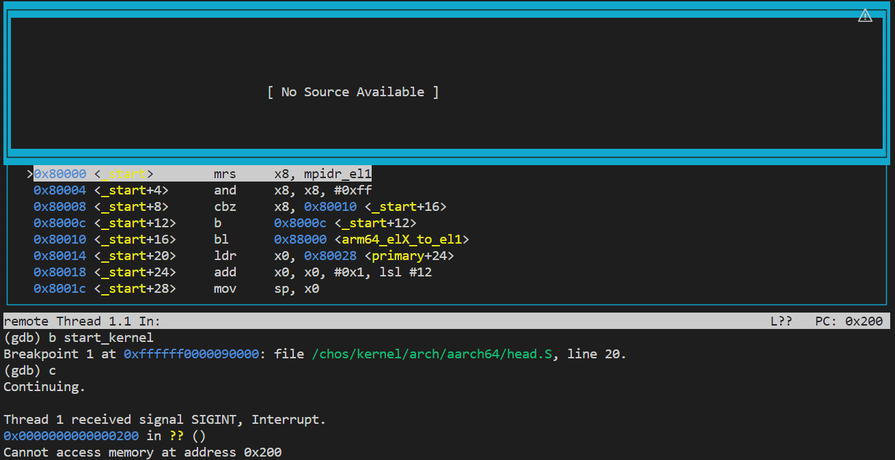
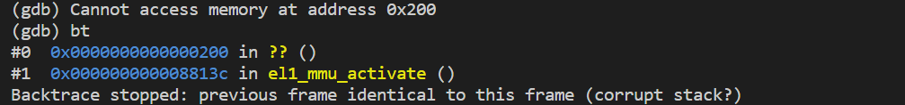
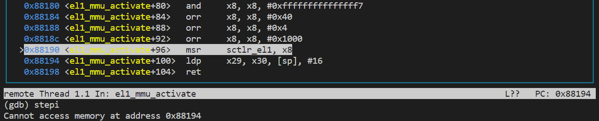
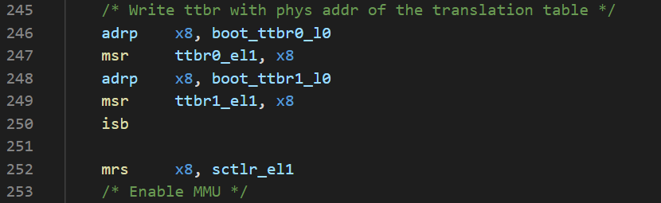

### 思考题1

优势：一方面，多级页表极大地节省了内存空间。由于虚拟地址空间的大部分虚拟页都是未分配的，没有必要为每一个虚拟页都保留一个页表项。多级页表使得我们无需为大量未分配的虚拟页分配低级的页表，从而极大地节省了页表占用的内存空间。另一方面，多级页表使得我们可以方便地管理和使用大页，从而有效地满足对大块内存空间的需求，在某些场景下可以很好地提高内存访问效率。

劣势：多级页表增加了页表查询的内存访问次数。但是，由于程序大都有很好的局部性，所以可以采用TLB来减少地址翻译的访存次数。因此，多级页表并不会对地址翻译的效率产生显著影响。

以4K粒度映射，每个页表页的大小是4K，因此一个页表页中最多包含4K / 8 = 512个页表项。0~4G的虚拟地址空间需要4G / 4K = 2^20^个L3页表项，需要 2^20^ / 512 = 2^11^个L3页表页，即需要2^11^=2048个L2页表项，需要2048 / 512 = 4个L2页表页，需要1个L1页表页和1个L0页表页。因此，总共需要1+1+4+2048=2054个页表页，大约占用8.02M的内存空间。

以2M粒度映射，每个页表页的大小是4K，因此一个页表页中最多包含4K / 8 = 512个页表项。0~4G的虚拟地址空间需要4G / 2M = 2^11^个L2页表项，需要 2^11^ / 512 = 4个L2页表页，需要1个L1页表页和1个L0页表页。因此，总共需要1+1+4=6个页表页，占用24K的内存空间。

### 练习题2

高地址空间的页表配置和低地址空间类似，不同的是高地址映射时，有 `va = pa + KERNEL_VADDR`，因此设置虚拟地址的初始值时，有 `kvaddr = PHYSMEM_START + KERNEL_VADDR`。代码中出现的其他物理地址宏，也必须加上 `KERNEL_VADDR` 转换成高地址虚拟地址来使用。在为 `L2` 配置页表项时，指向的物理地址应该是 `kvaddr - KERNEL_VADDR`。

### 思考题3

`init_boot_pt` 配置好页表后，`el1_mmu_activate` 函数会启用MMU，开启地址翻译，但直到 `start_kernel` 才会使用高地址。如下图所示，在第266行修改 `sctlr_rl1` ，开启虚拟内存机制。在此之前，PC等地址都采用的是低地址。此后，这些地址都将被MMU翻译。如果不为低地址配置页表，MMU在地址翻译时将会出错。



以下是为低地址配置页表后，gdb的运行结果，代码顺利运行到 `start_kernel` 函数：



如果将为低地址配置页表的代码注释掉，再次运行，程序将会卡住，说明发生了异常。按下Ctrl-C，PC值此时为0x200：



用 `bt` 指令看一下栈，发现是在 `el1_mmu_activate` 函数中出错的，应该是启动MMU的下一行代码运行出错：



gdb的运行结果支持了上述的解释和猜测：



### 思考题4

在 `el1_mmu_activate` 函数中，开启MMU之前，用外部变量 `boot_ttbr0_l0` 和 `boot_ttbr1_l0` 的值设置寄存器 `ttbr0_el1` 和 `ttbr1_el1`，将低地址和高地址的L0页表的物理地址存入TTBR寄存器，完成页表基地址的配置：



`boot_ttbr0_l0` 和 `boot_ttbr1_l0` 两个变量在 `mmu.c` 中定义为全局变量，在 `tools.S` 中由 `.extern` 声明为外部变量。

之所以要执行isb指令，是因为页表基地址必须在启用MMU之前成功配置，否则地址翻译将会出错。

### 练习题5

`split_page`：如果当前块的order和期望的order一致，则返回当前块。否则减小当前块的order，寻找其buddy，将buddy设为空闲块放入空闲表，继续递归分割当前块。

`buddy_get_pages`：从期望的order开始增大order，寻找可以满足期望order的最小块。如果某一order的空闲表不为空，则从链表头部取出链表结点，得到包含该结点的page，将page分割为期望的order后，返回给上层。

`merge_page`：寻找当前块的buddy，如果buddy已经被分配，则返回当前块，即为合并可以得到的最大块。否则将buddy从空闲表移除，并选择地址较低的元数据区域作为合并后块的元数据区域，继续递归合并这个合并后的块，直到无法合并或者当前块的order已经达到最大。

`buddy_free_pages`：合并当前块，将合并后的块放入空闲表。

### 练习题6

`get_next_ptp`：调用 `get_pages(0)` 分配一个新的页作为页表页，得到其内核虚拟地址。如果返回不为空，则将新的页表页清零。将 `new_pte_val.pte` 清零，将 `is_valid` 和 `is_table` 位置为1，将 `next_table_addr` 置为新的页表页的PFN。最后将 `new_pte_val.pte` 设置到 `cur_ptp->ent[index]` 中。

`query_in_pgtbl`：从L0开始，逐级调用 `get_next_ptp` 函数，向下遍历各级页表，调用时 `alloc` 参数设置为 `false`。对于L1和L2页表项指向的页，如果是 `BLOCK_PTP` 则计算其物理地址，返回。否则继续向下查询。

`map_range_in_pgtbl`：从L0开始，逐级调用 `get_next_ptp` 函数，直到得到L3的页表页，调用时 `alloc` 参数设置为 `true`。从va开始逐页映射，如果当前L3页表页的页表项用完，则使用L2页表页下一个页表项所指向的L3页表页，以此类推。

`unmap_range_in_pgtbl`：与map相似，只是 `alloc` 应该设为 `false`，对于每一个unmap块的PTE，设置其 `is_valid` 为0。

### 练习题7

`map_range_in_pgtbl_huge`：如果当前还能以1G块映射，就填充L1页表项进行映射。接着，如果还能以2M块映射，就填充L2页表项进行映射。剩余的以4K页映射。不同大小块的映射方式与4K类似。

`unmap_range_in_pgtbl_huge`：与map类似，只是 `alloc` 应该设为 `false`，对于每一个unmap块的PTE，设置其 `is_valid` 为0。

### 思考题8

需要配置页表描述符的AP，将其设置为Read Only。多个进程以只读的方式映射到同一段物理内存，共享这段物理内存。当一个进程想要写入时，会触发一个Permission fault。内核调用异常处理函数，发现该错误是向写时拷贝区域(linux利用vm_area_struct的vm_flags来标识)写入引起的，会在物理内存中新建该页的一个副本，修改页表项指向副本，恢复该进程的读写权限。当异常处理程序返回后，CPU重新执行写操作，就可以正常执行了。

### 思考题9

对于内核来说，粗粒度的映射最大的问题是粗粒度的权限控制，会给内核的安全带来隐患。如果一个大页必须被设置为可读可写，那该页上一些不应该被修改的数据可能被攻击者篡改，从而对内核的安全造成威胁。

粗粒度映射也可能导致内存碎片化，降低内存的利用率。不过，在内核中，我们可以通过SLAB分配器来分配较小的内存块，提高内存的利用率。

### 挑战题10

在 `page_table.S` 中，仿照 `set_ttbr0_el1`，添加一个 `set_ttbr1_el1` 函数，以L0页表页的物理地址作为参数，设置 `ttbr1_el1` 寄存器。

在 `page_table.c` 中，用 `extern` 声明 `set_ttbr1_el1` 函数。添加一个 `reset_el1_page_table` 函数，用来分配页表页、映射内核地址空间：

``` c
void reset_el1_page_table() {
#define PHYSMEM_START   (0x0UL)
#define PERIPHERAL_BASE (0x3F000000UL)
#define PHYSMEM_END     (0x40000000UL)
#define PHYSMEM_MAX     (0xFFFFFFFFUL)

#define PTP_ENTRIES_NUM 512

    void* pgtbl = get_pages(0);
    memset(pgtbl, 0, sizeof(u64) * PTP_ENTRIES_NUM);
    map_range_in_pgtbl(pgtbl, KBASE, PHYSMEM_START, PERIPHERAL_BASE - PHYSMEM_START, 0);
    map_range_in_pgtbl(pgtbl, KBASE + PERIPHERAL_BASE, PERIPHERAL_BASE, PHYSMEM_END - PERIPHERAL_BASE, VMR_DEVICE);
    map_range_in_pgtbl(pgtbl, KBASE + PHYSMEM_END, PHYSMEM_END, PHYSMEM_MAX - PHYSMEM_END, VMR_DEVICE);
    set_ttbr1_el1(virt_to_phys(pgtbl));
}
```

由于要配置的是内核的页表，所以我们需要新增一些和flags有关的宏定义，在 `page_table.c` 中：

``` c
#define USER_PTE 0
#define KERNEL_PTE 1
```

在 `page_table.h` 中：

``` c
/* Read-write permission. */
#define AARCH64_MMU_ATTR_PAGE_AP_HIGH_RW_EL0_NONE (0)
#define AARCH64_MMU_ATTR_PAGE_AP_HIGH_RW_EL0_RW   (1)
#define AARCH64_MMU_ATTR_PAGE_AP_HIGH_RO_EL0_NONE (2)
#define AARCH64_MMU_ATTR_PAGE_AP_HIGH_RO_EL0_RO   (3)

/* X: execution permission. U: unprivileged. P: privileged. */
#define AARCH64_MMU_ATTR_PAGE_UX  (0)
#define AARCH64_MMU_ATTR_PAGE_UXN (1)
#define AARCH64_MMU_ATTR_PAGE_PX  (0)
#define AARCH64_MMU_ATTR_PAGE_PXN (1)
```

修改 `page_table.c` 中的 `set_pte_flags` 函数，使其可以支持 `KERNEL_PTE`：

``` c
else if(kind == KERNEL_PTE) {
    // EL1 can r/w kernel region and EL0 can do nothing.
    entry->l3_page.AP = AARCH64_MMU_ATTR_PAGE_AP_HIGH_RW_EL0_NONE;
    // EL0 cannot directly execute EL1 accessiable region.
    entry->l3_page.UXN = AARCH64_MMU_ATTR_PAGE_UXN;
    // EL1 can directly execute EL1 accessiable region.
    entry->l3_page.PXN = AARCH64_MMU_ATTR_PAGE_PX;
    // Set AF (access flag) in advance.
    entry->l3_page.AF = AARCH64_MMU_ATTR_PAGE_AF_ACCESSED;
    // Mark the mapping as not global
    entry->l3_page.nG = 1;
    // Mark the mappint as inner sharable
    entry->l3_page.SH = INNER_SHAREABLE;
    // Set the memory type
    if (flags & VMR_DEVICE) {
            entry->l3_page.attr_index = DEVICE_MEMORY;
            entry->l3_page.SH = 0;
    } else if (flags & VMR_NOCACHE) {
            entry->l3_page.attr_index = NORMAL_MEMORY_NOCACHE;
    } else {
            entry->l3_page.attr_index = NORMAL_MEMORY;
    }
}
```

将所有用到 `set_pte_flags` 函数的地方改为：

``` c
set_pte_flags(pte, flags,
((va + cursor < KBASE)? USER_PTE : KERNEL_PTE));
```

最后，在 `main.c` 中引入 `reset_el1_page_table` 函数，并在 `mm_init` 函数之后调用它。内核页表被重新配置，通过了之后对 `kmalloc` 和 `page_table` 的测试：

<image src="assets/lab2/7.png" />